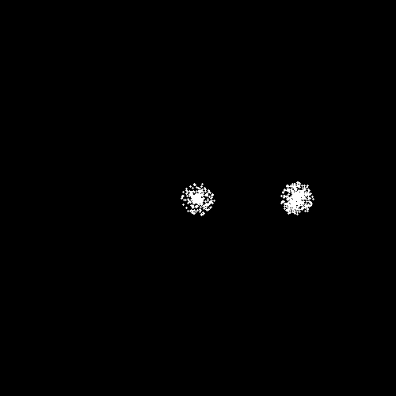
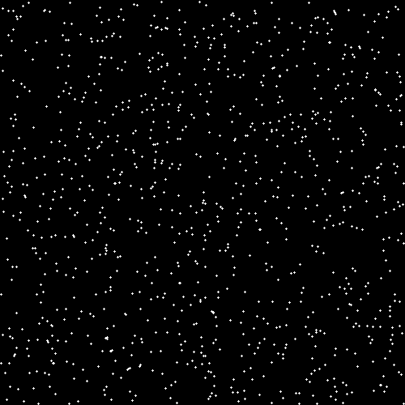
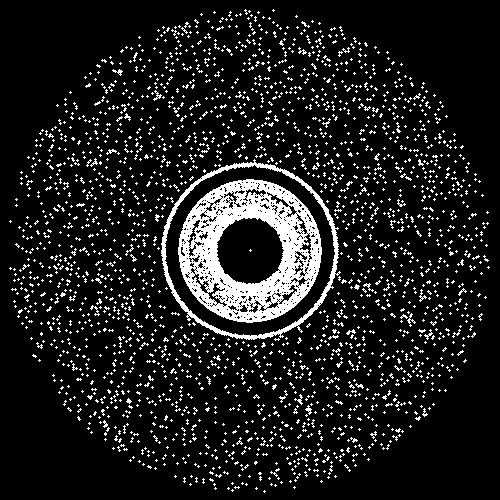

#  <br> N-Body Simulations

## Introduction
In physics and astronomy, an N-body simulation is a simulation of a dynamical system of particles, usually under the influence of physical forces, such as gravity. N-body simulations are widely used tools in astrophysics, from investigating the dynamics of few-body systems like the Earth-Moon-Sun system to understanding the evolution of the large-scale structure of the universe.

## Illustration


## Simulations

| Planets (1) | Planets (2) | Perfect gas |
|:-:|:-:|:-:|
||||
| Galaxy (2) | Galaxy (3) | Galaxy (3 - Inverse force) |
||||

## Installation

- First of all, it is **required** to install gcc on your computer (installed by default on MAC). If it nos already done, you can do it using the following [link](https://www.scaler.com/topics/c/c-compiler-for-windows/).

- Then, starting from the root foolder, you need to recompile the project using the commands

```
cd src
make
```

## Running a simulation

- Firstly, you must place in the *simulations* folder your simulation file in a .txt format. The file must contain the total number of particles and the radius of the space as well as the position, velocity and mass of every particles. An exemple of such a file is the following (planets_1.txt):

```
5
2.5E11
0.000E00 0.0 0.0 0.000E00 4.97250E41
5.790E10 0.0 0.0 2.395E10 8.25500E34
1.082E11 0.0 0.0 1.750E10 1.21725E36
1.496E11 0.0 0.0 1.490E10 1.49350E36
2.279E11 0.0 0.0 1.205E10 1.60475E35
```

- Finally, starting from the root folder, you can execute the program using the following syntax:

```
./nbodysimul <datatype> <method> <maxt> <deltat> <output>
```

where,

```
- <datatype> : 'random <n>' to generate a random galaxy of n bodies (perfect gas simulation) 
               or 'file simulations/<filename>' to load a galaxy from a file.
- <method>   : simulation methods either naive or bht
- <maxt>     : the total duration, in real time, of the simulation
- <deltat>   : the delta of time (use 0.1)
- <output>   : none (to estimate computing times) or gif
```

As an illustration:

```
./nbodysimul random 10 naive 100 0.1 gif
./nbodysimul file simulations/planets_1.txt bht 5000 0.1 gif
```

**NOTE**
- The result will be placed in the *results* folder.
- The *naive* method consist of computing every particle interactions, this approach is very slow. However, using the *bht* method, 
  the solution will be computed using a N-Body method that reduces greatly the computation time.
